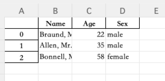
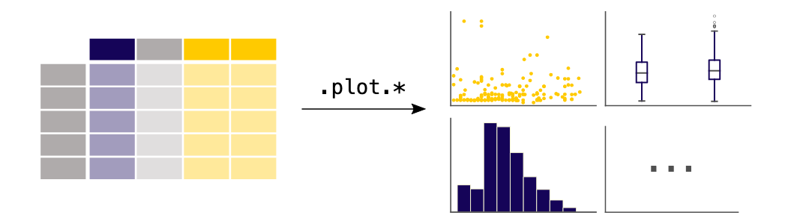
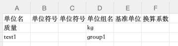

# Pandas-30minutes For QA

**What is Pandas?**
> **Python lib to handle ***data***.**

## 1.Talking about data 

**What kind of data Pandas to handle:**

- **DataFrame**: Tablular data;header/column/row data
- **Series**: each column in a dataframe is series

---

## 1.1 Examples for DataFrame and Series data

1. **DataFrame**:


---

```python
df_cr= pd.DataFrame({
  "Name":["Braund, Mr. Owen Harris",
            "Allen, Mr. William Henry",
            "Bonnell, Miss. Elizabeth",],
  "Age": [22, 35, 58],
        "Sex": ["male", "male", "female"],
})
print(df_cr)
```
---

2. **Series**: each column in a dataframe is series


---

```python
print(df_cr["Age"])
print(df_cr['Age'].max())
print(df_cr['Age'].min())
print(df_cr['Age'].mean())
```
---

## 2.Read and Write Tablular Data
Tabluar data:




---

```python

```


## 3. Select Subset of Dataframe

What does subset mean?


--- 


## 5. Create Plot 


---

## 6. Read Excel/CSV data to Python object



```python
import pandas as pd
from pydantic import BaseModel,Field,ConfigDict
class UnitInfoRawModel(BaseModel):
    unit_name: str = Field("", alias='单位名')
    unit_symbol: str = Field("", alias='单位符号')
    unit_symbol_latex: str = Field("", alias='单位符号LaTex')
    unit_group_name: str = Field("", alias='单位组名称')
    base_unit: str = Field("", alias='基准单位')
    conversion_factor: None|str |float = Field("", alias='换算系数')

    model_config = ConfigDict(
        arbitrary_types_allowed=True,
        populate_by_name=True,
        use_enum_values=True,
    )

df = pd.read_excel("x.xlsx", na_filter=False, na_values=['NaN'])
t_list = []
for index, row in df.iterrows():
        t_list.append(UnitInfoRawModel(**row.to_dict()))
print(t_list)
```